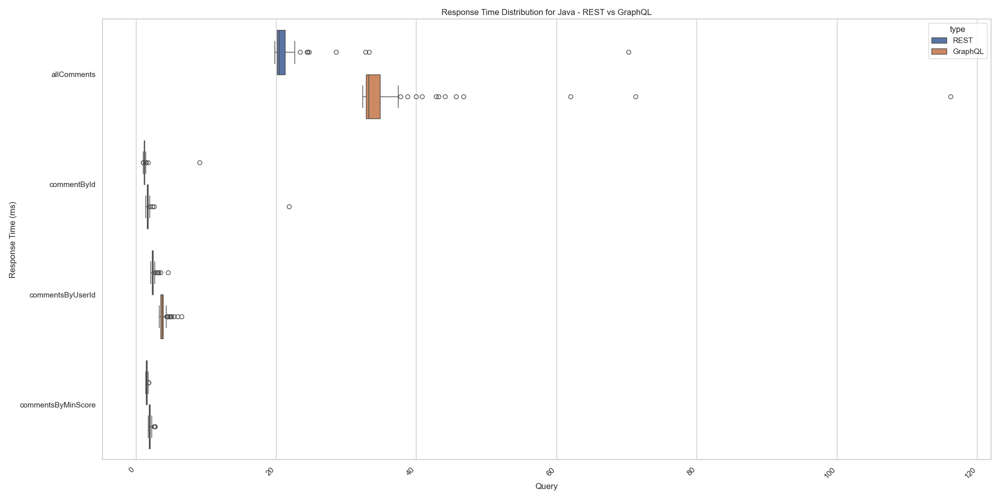
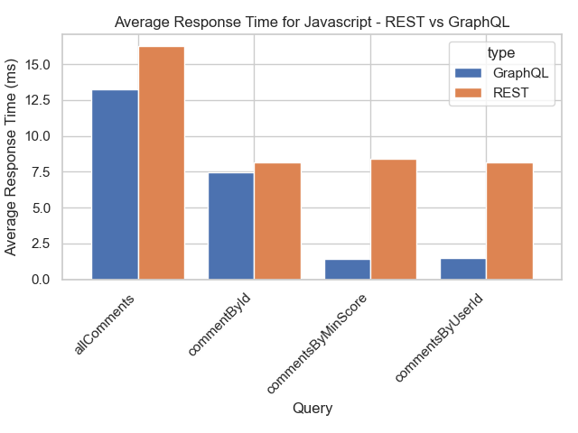

# Análise comparativa da performance de web APIs GraphQL vs REST

## 1. Introdução

Neste trabalho, realizou-se um experimento controlado com o objetivo de comparar a performance de APIs web quando implementadas em GraphQL versus REST. A fim de nortear este estudo, foram estabelecidas as seguintes questões de pesquisa:

- **RQ 01**: Respostas às consultas GraphQL são mais rápidas que respostas às consultas REST?
- **RQ 02**: Respostas às consultas GraphQL tem tamanho menor que respostas às consultas REST?

## 2. Design do experimento

O experimento foi elaborado visando assegurar a validade dos resultados e responder às questões de pesquisa propostas. Para isso, foram definidos hipóteses, variáveis dependentes e independentes, além de tratamentos que representam as combinações de condições a serem comparadas.

#### 1. Hipóteses Nula e Alternativa

|                           | RQ 01                                               | RQ 02                                                   |
| ------------------------- | --------------------------------------------------- | ------------------------------------------------------- |
| Hipótese nula (H₀)        | Não há diferença significativa no tempo de resposta | Não há diferença significativa no tamanho das respostas |
| Hipótese alternativa (Hₐ) | GraphQL tem tempos de resposta menores              | GraphQL tem respostas menores                           |

#### 2. Variáveis Dependentes

- **RQ 01**: Tempo de resposta (em ms)
- **RQ 02**: Tamanho do `response body` (em número de caracteres)

#### 3. Variáveis Independentes

| Fator                        | Níveis               |
| ---------------------------- | -------------------- |
| Tipo de implementação de API | `GraphQL`, `REST`    |
| Linguagem                    | `JavaScript`, `Java` |

#### 4. Tratamentos

1. API implementada em GraphQL com JavaScript
2. API implementada em REST com JavaScript
3. API implementada em GraphQL com Java
4. API implementada em REST com Java

#### 5. Objetos Experimentais

Os objetos experimentais consistem em:

- APIs: Quatro APIs criadas para o experimento, conforme detalhado na combinação de tratamentos.
- Dados: Uma base de dados simulada e representativa para as consultas, contendo dados de comentários do fórum Language Learning, do Stack Exchange.

#### 6. Tipo de Projeto Experimental

O experimento segue um projeto fatorial, com combinações de tratamento em desenho cruzado (crossing).

#### 7. Quantidade de Medições

|                                  | Medições de tempo de resposta | Medições de tamanho da resposta |
| -------------------------------- | ----------------------------- | ------------------------------- |
| Consultas GraphQL com JavaScript | 400                           | 60                              |
| Consultas REST com JavaScript    | 400                           | 60                              |
| Consultas GraphQL com Java       | 400                           | 60                              |
| Consultas REST com Java          | 400                           | 60                              |
| **Total**                        | **1600**                      | **240**                         |

Os resultados das medições estão disponíveis no diretório [code/client/results](../code/client/results).

#### 8. Ameaças à Validade

- _Validade interna_: pode ser comprometida por variações ambientais, como de rede ou de hardware. Para mitigar esses efeitos, os testes foram executados múltiplas vezes em um ambiente controlado.

- _Validade externa_: pode ter a generalização limitada pelo uso da base de dados simplificada, uma vez que os resultados podem ser drasticamente diferentes dependendo da complexidade do conjunto de dados utilizado para implementaçao das APIs.

## 3. Metodologia

### 3.1. Criação do Dataset

Como objeto do experimento, utilizou-se um dataset simulado contendo dados, em JSON, de comentários do fórum Language Learning, do Stack Exchange. Os data dumps estão publicamente disponíveis em https://archive.org/download/stackexchange/.

Exemplo de atributos presentes no conjunto de dados:

```json
{
  "id": "6",
  "postId": "1",
  "score": "1",
  "text": "I asked a question similar to this regarding Spanish and French. Non-related languages seem to be easier to differentiate over time, while related languages can cause conflicts that persist.",
  "creationDate": "2016-04-05T17:35:07.133",
  "userId": "6"
}
```

### 3.2. Consultas

Foram executadas as seguintes consultas sobre o dataset, implementadas nas respectivas linguagens de cada tratamento:

- `allComments`: Retorna todos os comentários
- `commentById`: Retorna um comentário de id específico
- `commentsByUserId`: Retorna comentários feitos por usuário de id específico
- `commentsByMinScore`: Retorna comentários com o valor maior or igual a um _score_ especificado entre 0 e 10

## 5. Resultados

Nesta seção, são apresentados os resultados do experimento para os tratamentos, conforme cada linguagem de implementação.

### 5.1. Tempos de Resposta (RQ 01)

#### 5.1.1. Java


_Figura 1: Distribuição dos Tempos de Resposta_

A Figura 1 apresenta a distribuição dos tempos de resposta em milissegundos para diferentes tipos de consulta. Observa-se que:

- Para a consulta `allComments`, o tempo de resposta em GraphQL apresenta outliers, enquanto a REST apresenta uma distribuição mais concentrada com valores médios inferiores.
- Nas demais consultas (`commentById`, `commentsByUserId` e `commentsByMinScore`), os tempos de resposta são mais uniformes, mas REST continua mostrando valores médios e variabilidade menores em relação ao GraphQL.



_Figura 2: Médias dos Tempos de Resposta_

Os resultados da Figura 2 destacam que:

- O tempo médio de resposta para a consulta `allComments` em REST é significativamente menor do que em GraphQL.
- Para as outras consultas, embora as diferenças sejam menores, REST ainda apresenta tempos ligeiramente melhores.

#### 5.1.2. JavaScript



_Figura 3: Distribuição dos Tempos de Resposta_

A Figura 3 apresenta a distribuição dos tempos de resposta para diferentes tipos de consulta. Os principais destaques incluem:

- Para a query `allComments`, o GraphQL apresenta menor variabilidade e valores médios inferiores quando comparado ao REST, sugerindo um desempenho superior para este caso.
- As consultas `commentById` e `commentsByUserId` mostram desempenho melhor em REST, com tempos médios menores e menor dispersão dos dados.
- Na consulta `commentsByMinScore`, o GraphQL apresenta tempos de resposta consistentemente menores, sugerindo uma vantagem significativa para essa query.


_Figura 4: Médias dos Tempos de Resposta_

Os resultados da Figura 4 destacam que:

- Em `allComments`, o tempo médio de GraphQL é inferior ao de REST, um padrão oposto ao observado nas implementações em Java.
- Mais uma vez, `commentsByMinScore` apresenta-se mais eficiente quando em GraphQL.

### 5.2. Tamanhos de Resposta (RQ 01)

#### 5.2.1. Java


_Figura 5: Distribuição dos tempos de resposta_

#### 5.2.2. JavaScript


_Figura 6: Distribuição dos tempos de resposta_

### 5.3. Comparação Geral

Esses resultados sugerem que o desempenho de APIs WEB em GraphQL e REST não depende apenas do tipo de consulta, mas também da linguagem de implementação. Enquanto REST se mostra mais eficiente em Java, GraphQL pode oferecer vantagens em JavaScript, sobretudo em consultas que demandam maior flexibilidade ou customização de parâmetros retornados. Ademais, quanto ao tamanho das respostas, é evidente que GraphQL apresenta _response bodies_ mais extensos para Java, enquanto que, para JavaScript, os resultados são mistos.
